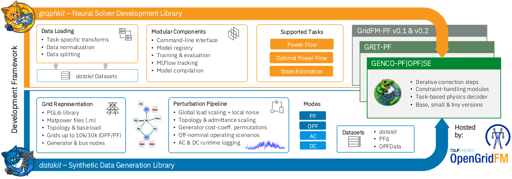

# Reproduce the GENCO paper

Paper sources and step-by-step guides for reproducing the results of [GENCO — A Unified Neural Solver Embedded in a Development Framework for Steady-State Grid Analysis](https://arxiv.org/abs/2608.09921) (arXiv:2608.09921).

<p align="center">
  
</p>

Start with the section guides in [`repro/`](repro/).

## Cite

```bibtex
@article{puech2026gencounifiedneural,
  title={GENCO - A Unified Neural Solver Embedded in a Development Framework for Steady-State Grid Analysis},
  author={Alban Puech and Matteo Mazzonelli and Tamara R. Govindasamy and Mangaliso Mngomezulu and Héctor Maeso-García and Thomas Tolhurst and Javad Bayazi and Ali Moeini and Naomi Simumba and Celia Cintas and David Nelischer and Romeo Kienzler and Jonas Weiss and Anna Varbella and Florian Dörfler and Gabriela Hug and Martin Mevissen and Juan Bernabé-Moreno and François Mirallès and Hendrik F. Hamann and Etienne Vos and Thomas Brunschwiler},
  journal={arXiv preprint arXiv:2608.09921},
  year={2026},
  url={https://arxiv.org/abs/2608.09921}
}
```
